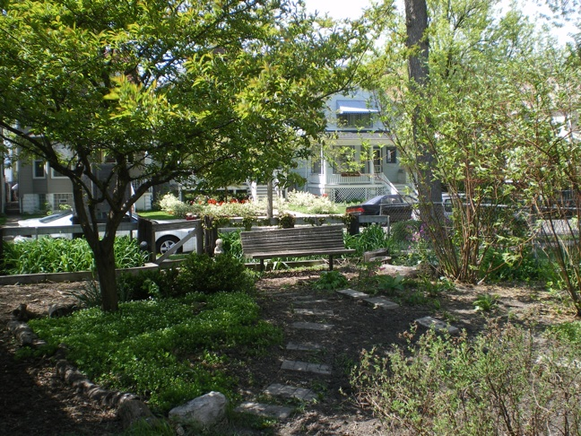

## Our Story
The Monticello Community Garden is a shared garden experience on North Monticello Avenue between
Palmer and Belden. 

It's a place for neighbors to gather for work, fascinating conversation, and  to learn more about gardening. The space is a [garden plot](http://neighbor-space.org/monticello-community-garden/) in Chicago's [NeighborSpace](http://neighbor-space.org/) program, providing herbs, produce and flowers to the neighborhood.

The garden started as an informal project. After an abandoned building was torn down, a guerrilla garden sprang up. Around 2000 the lot took shape with neighbors from 2200 North Monticello. A few trees were planted, and people organized plots. Around 2002, the [Green Corps Chicago](https://greencorpschicago.org/) helped build three raised tiers. Eventually these beds collapsed and the neighborhood came together to build one very large raised bed, filled with organic soil. 

NeighborSpace visited the garden joining the NeighborSpace program began in 2008. Established as a NeighborSpace garden, the gardeners received support for building six more raised beds, completed in 2011.

There are movies in the garden, an annual block party, and a beautiful mosaic sign made with from neighborhood children.